# Creative Coding - Wendy Marseille

Bienvenue dans mon projet de **Creative Coding**, où je vous invite à explorer mes exercices réalisés autour du **Drag & Drop**, des **Slides**, et de la **Réalité Augmentée** (AR). Chaque étape reflète mon apprentissage et mes expérimentations avec des librairies puissantes comme **Draggabilly** et **MindAR**.

## I - Drag & Drop

### Exercice 1 : Déplacer une carte avec Draggabilly

Dans cet exercice, j'ai utilisé la librairie **Draggabilly** pour déplacer une carte sur l'axe **x**. Cela m'a permis de comprendre les bases du **Drag & Drop** et de créer une interaction fluide.

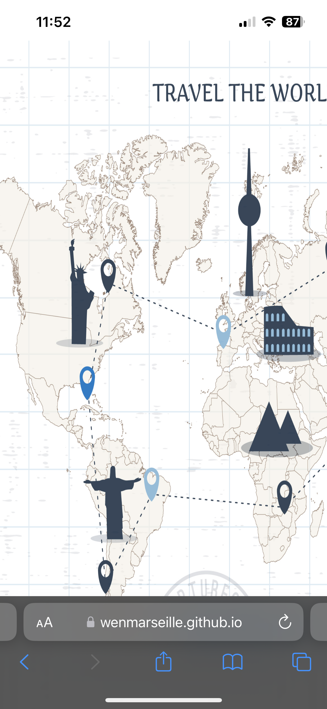

### Exercice 2 : Déplacer une image sur les axes X et Y

J'ai poussé l'exercice précédent en ajoutant une interaction **multidimensionnelle** : déplacer une image sur les axes X et Y. J'ai également personnalisé l'interface avec un **header** pour améliorer l'expérience utilisateur.

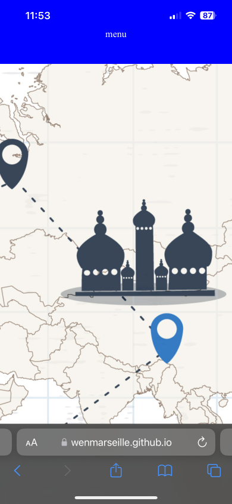

## II - Slides

### Exercice 1 : Créer un diaporama dynamique avec Slider

Ici, j'ai créé un diaporama fluide en utilisant la librairie **Slider**. J'ai ajouté un **header** et une **description** pour chaque slide afin d’enrichir l’expérience visuelle et rendre la présentation plus dynamique.

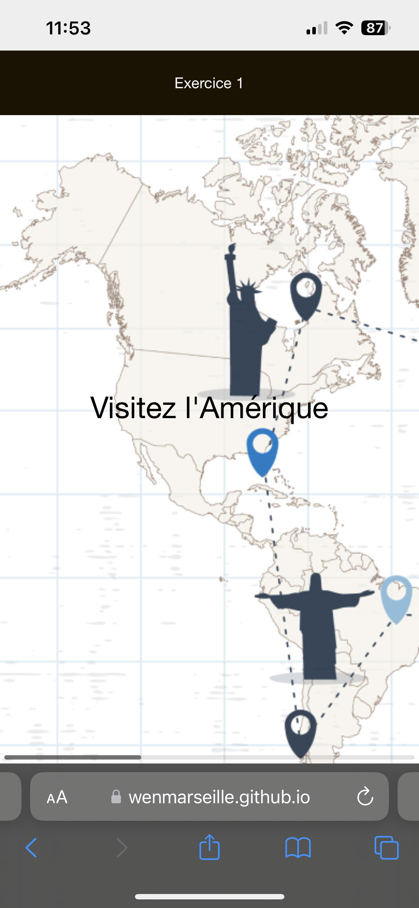

## III - Augmented Reality (AR)

### Base : Découverte de la librairie MindAR

J'ai exploré la librairie **MindAR** pour me familiariser avec les concepts de la réalité augmentée. J'ai suivi les instructions de la documentation et réalisé un premier test de base.

### Personnalisé : Tester l'AR avec des images cibles

Pour aller plus loin, j'ai personnalisé l'expérience en ajoutant une **image cible** (comme la **Tour Eiffel**) pour voir l'interaction en AR.

Résultat :

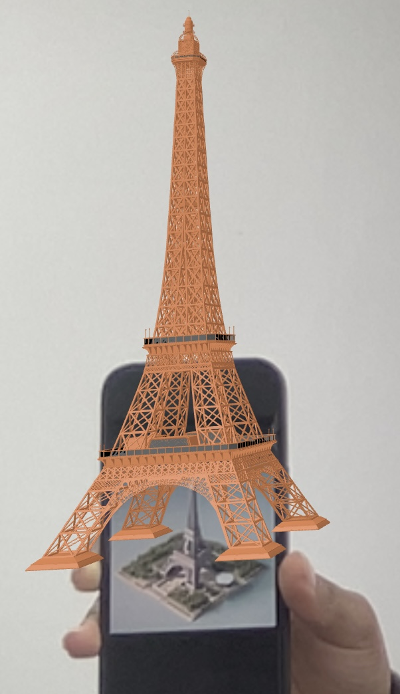

J'ai ensuite testé une interaction plus complexe avec **deux images cibles**, ce qui a permis d'enrichir l'expérience de réalité augmentée.

Résultat :

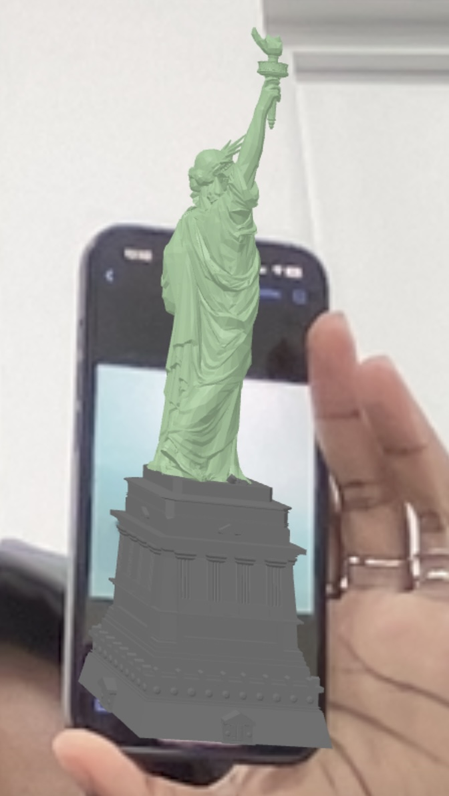

# IV - Rendu final : ✈️ ScanFly, L'application interactive pour une exposition immersive  

## 📝 Description  
ScanFly est une application mobile conçue pour transformer une exposition en une aventure interactive et ludique. Grâce à une chasse aux monuments emblématiques, elle capte l'attention des visiteurs, les engage et enrichit leur expérience tout au long du parcours.  

## 🎯 Objectif  
L'objectif principal de ScanFly est de :  
- **Maintenir l'attention des visiteurs** à travers un gameplay interactif.  
- Proposer une **découverte éducative** des monuments emblématiques dans un cadre ludique.  
- Faciliter une **connexion immersive** avec le contenu de l'exposition.  

## 🚀 Parcours Utilisateur  

### **1. Écran d'Accueil**  
- Message principal : **"Voyager n’a jamais été aussi simple."**  
- Illustration accrocheuse qui donne envie de prendre part au voyage.  
- Action : un bouton **Commencer** qui lance l'expérience.  

### **2. Onboarding : Embarquez pour le voyage**  
- **Introduction immersive** :  
  > "Bienvenue à bord du vol LO-2314XXX ScanFly ! Embarquez et partez à la découverte des monuments emblématiques dissimulés dans l'exposition."  
- Détails affichés : numéro de vol et date symbolique.  
- **Instructions claires** :  
  - Trouver les images des monuments cachées dans l'exposition.  
  - Scanner ces images avec l'application pour débloquer les monuments.    
- **Action** : bouton **Commencer** pour passer à la carte interactive.  

### **3. Carte Interactive**  
- Une carte visuelle et intuitive affichant les monuments emblématiques répartis sur différents continents.  
- Fonctionnalités :  
  - Cliquer sur un bouton pour scanner un monument dans l'exposition.  
  - Naviguer librement pour explorer les options.  
- Une approche interactive favorisant l'exploration autonome.  

### **4. Découverte et Exploration**  
- **Gamification** :  
  - Les visiteurs scannent les images des monuments cachées dans l'exposition avec l’application.  
  - Chaque monument scanné débloque des images illustratives originales.  
- **Éducation ludique** :  
  - Une présentation enrichissante et engageante des monuments pour apprendre tout en s’amusant.  

## 🖼️ Images Cibles de l'Exposition  
Les visiteurs doivent retrouver et scanner ces images pour débloquer les informations des monuments :   
**Slide 1**

   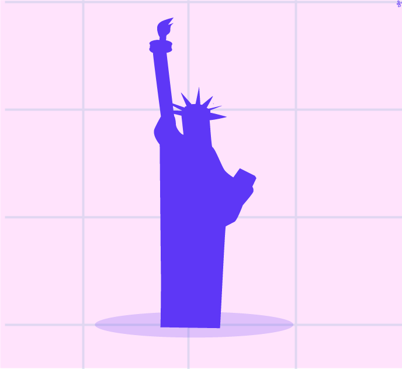   
   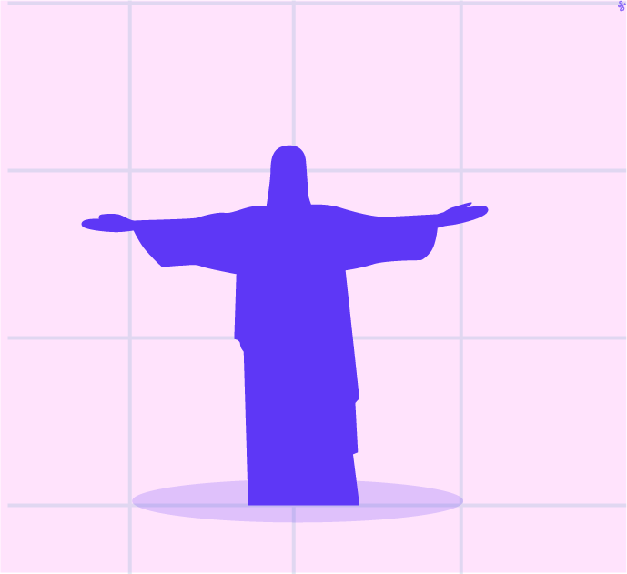 

**Slide 2**

   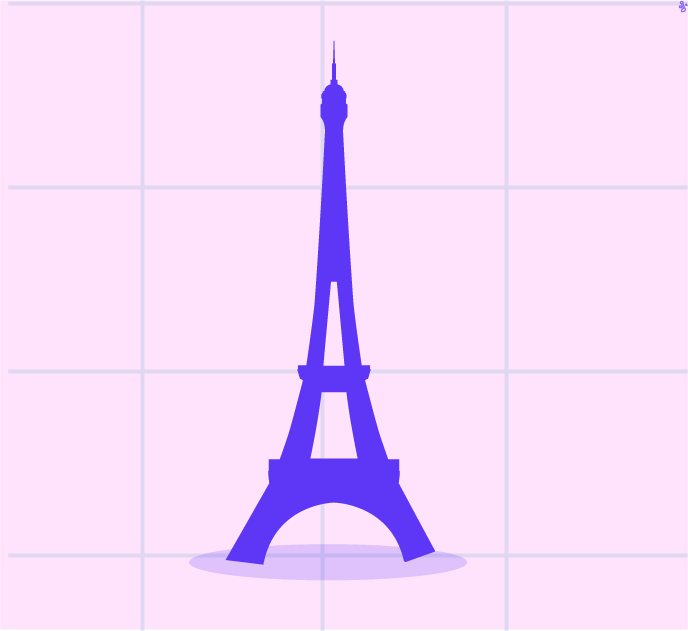 
   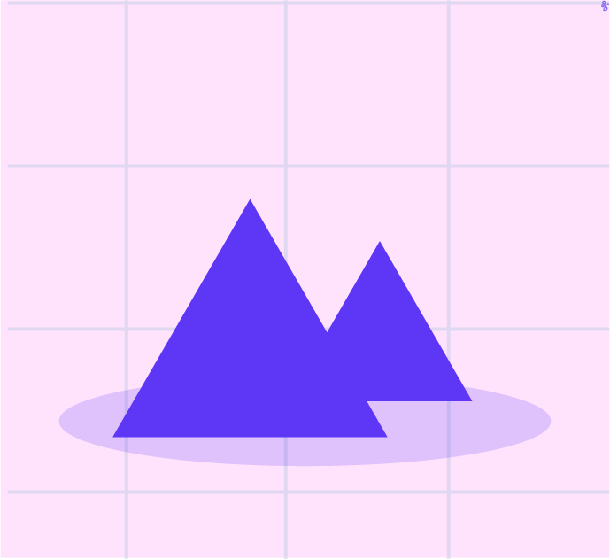

**Slide 3**  

     

## 🎯 Résultats du Scan  

### Exemples de Résultats après le Scan :  
Lorsque le visiteur scanne un monument, il découvre une image illustrative originale du monument scanné.  

Voici des exemples de résultats : 

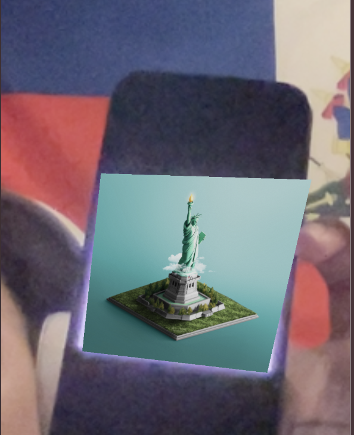  
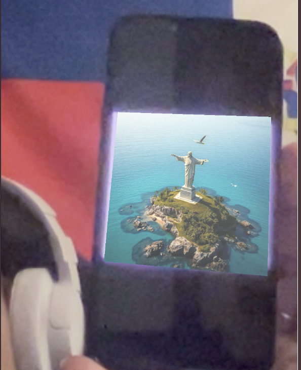
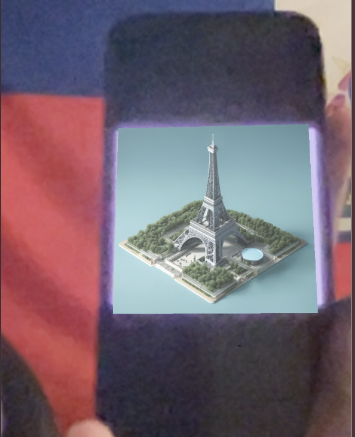
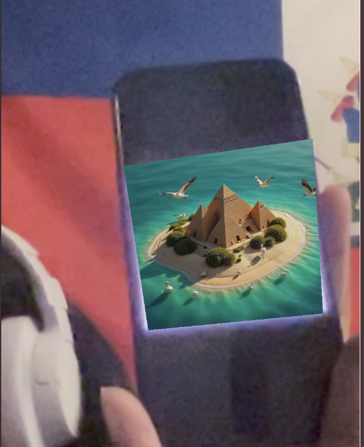
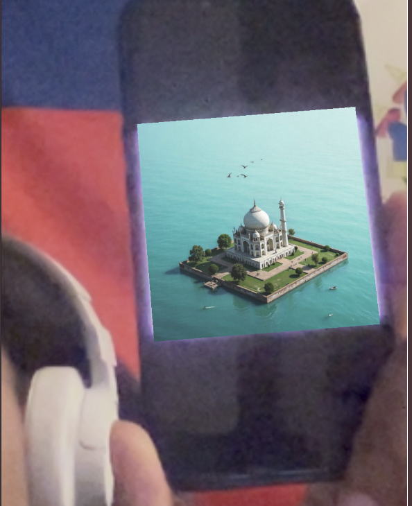  

Merci monsieur Tilly pour votre professionnalisme et vos enseignements ! Bonne continuation.

